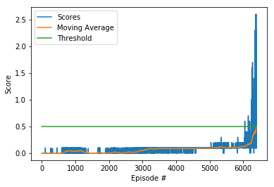

### Udacity Deep Reinforcement Learning Nanodegree
## Project 2: Continous Control

# Background
------------
Reinforcement learning is an area of Machine Learning that trains **AGENTS** to perform **ACTIONS** on an **ENVIRONMENT**, based on the action performance, the agent would receive a **REWARD** and the agents objective is to maximize **CUMULATIVE FUTURE REWARDS**.

Agents in general can be aware of the environment and task in advance, or simply the agents can start training without having information on the environment and the task, and let the reward system guide them to find the **OPTIMUM POLICY** leading to maximum future rewards for the given task.

Reinforcement Learning agents adaption is becoming more popular specially with the emergence of project like:

- [Self-Driving Cars](https://arxiv.org/pdf/1811.11329.pdf)
- [Autnomous Drones](https://arxiv.org/pdf/1801.05086.pdf)
- [Traffic Light Control](https://towardsdatascience.com/applications-of-reinforcement-learning-in-real-world-1a94955bcd12)
- [Industrial Robots](https://www.sciencedirect.com/science/article/pii/S221282711730241X)

And many other applications.

Compared to traditional control systems, Reinforcement Learning agents outperform traditional control systems, when the environment and actions become more complex, where [research showed](https://arxiv.org/pdf/1902.07903.pdf) that for example, in power control for cellular networks, reinfrocement agents outperformed traditional methods in terms of power efficiency by **15%**.

# Objective
---------------------------

Objective of this assignment is to train **two** reinforcement learning agents to **compete** in tennis, this work is an implementaiton of Multi Agent DDPG algorithm [MADDPG algorith](https://arxiv.org/pdf/1706.02275.pdf). MADDPG is a model free algorithm, in other words, the agent is not aware of the model of the environment. Where multiple agents are trained to cooperate and/or compete, in a dynamic environment, where every agent sees its own observations, and act accordingly.

The agents trained to play tennis, using Unity's Tennis environment. The goal, is to get average maximum score of 0.5, by hitting the ball to the other agent without hitting the net or getting out of boundaries.

Every step the agent hits the ball and it doesn't miss, it receives a reward of +0.1, otherwise a reward of -0.01 is received if the net is hit or the ball goes out of bounds, otherwise 0. reward is received. For the task to be solved, the maximum of agents score average over 100 episodes should be more than 0.5.


# Environment
-------------
- State (observation) space: 24 variables per agent 
- Action space: Vector of 2 continous numbers between -1 and 1 per agent
- Objective: Mean max rewards of agents across 100 consecutive episodes of 0.5

# Getting Started
--------
## Activate the environment:
If you haven't already, please follow the [instructions in the DRLND GitHub repository](https://github.com/udacity/deep-reinforcement-learning#dependencies) to set up your Python environment. These instructions can be found in README.md at the root of the repository. By following these instructions, you will install PyTorch, the ML-Agents toolkit, and a few more Python packages required to complete the project.

(For Windows users) The ML-Agents toolkit supports Windows 10. While it might be possible to run the ML-Agents toolkit using other versions of Windows, it has not been tested on other versions. Furthermore, the ML-Agents toolkit has not been tested on a Windows VM such as Bootcamp or Parallels.

## Download the Unity Environment
The repo already includes the environment for [OSX Tennis Env](./Tennis.app). For different operating systems, please follow the links below:

- Linux: [click here](https://s3-us-west-1.amazonaws.com/udacity-drlnd/P3/Tennis/Tennis_Linux.zip)
- Mac OSX: [click here](https://s3-us-west-1.amazonaws.com/udacity-drlnd/P3/Tennis/Tennis.app.zip)
- Windows (32-bit): [click here](https://s3-us-west-1.amazonaws.com/udacity-drlnd/P3/Tennis/Tennis_Windows_x86.zip)
- Windows (64-bit): [click here](https://s3-us-west-1.amazonaws.com/udacity-drlnd/P3/Tennis/Tennis_Windows_x86_64.zip)

In case you download the environment, replace the existing environment in the repo, with the downloaded one.

## Instructions

Follow the instructions in [Tennis.ipynb](./Tennis.ipynb) to get started with training your own agents!

### Folders And Classes:
- classes: 
    - ddpg.py: DDPG based Agent
    - maddpg_v_1_0.py: Multi Agent Implementation of DDPG
    - memory_mod.py: Replay buffer
    - model_mod.py: Actor/Critic definitions
    - noise: Ornstein–Uhlenbeck process based noise
- models: Trained models
    - checkpoint_actor_0.pth
    - checkpoint_actor_1.pth
    - checkpoint_critic_0.pth
    - checkpoint_critic_1.pth

### File: Tennis.ipynb

Training and presentation of results for MADDPG based agents

# Results


- The agents achieved the target in 6389 episodes as displayed above


# Discusssion
- Introduction of Prioterized Experience Replay to improve the learning
- Improve the exploration strategy to reduce the learning time 


```python

```
