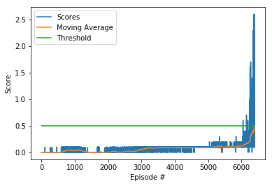

# Udacity Deep Reinforcement Learning Nano-degree
## Project: P3 - Collab Compete

<u>**This report aims at providing low level details of P3-Collab Compet implementation. For high level details, and dependencies, please refer to the README.md**</u>

## Dev Environment Introduction
--------
### Chosen Algorithm 

The algorithm of choice for this project is MADDPG, reason behind that are:
1- Availability of previous DDPG work, which makes the migration from DDPG to MADDPG is simpler
2- Action space is continous thus the requirement for a DDPG based solution
3- The nature of competition between the agents, and the dynamic nature of the environment

### Algorithm Details

The algorithm consists of the following classes, each class will be explained in details:

    1- Agents (2 agents)
    2- Memory
    3- Noise
    4- Models

Each agent has the following attributes:
    
    1.1 Actor - Local: Running actor network; defined in models
    1.2 Actor - Target: Target; not learning, actor network, identical architecture to Actor - Local
    1.3 Actor - Local Optimizer: Adam optimizer with 1e-3 learning rate
    1.4 Critic - Local: Running critic network; defined in models
    1.5 Critic - Target: Target; not learning, critic network, identical architecture to Critic - Local
    1.6 Critic - Local Optimizer: Adam optimizer with 1e-3 learning rate, and L2 weight decay of 0
    1.7 Noise - Ornstein–Uhlenbeck process based noise
    
The MultiAgent environemtn has the following methods:
    
    1.1 Step: This method takes an exepreince defined as: state, action, reward, next_state, done
        1.1.1 The experience is addedd to a common memory buffer for both agents
        1.1.2 If memory > batch size (256) and it is a learning step, a batch of 256 experiences is sampled, and then passed to the learn method for updating the actors/critics for 1 time. Steps to learn chosen is 2, and actors/critics are trained for 1 times. 
    1.2 Learn: This method takes a common experience sampled from the common replay buffer, and discount rate gamma, and does the following for EACH agent:
        1.2.1 Update the critic by getting the MSE of Q_local(state_t, action_t) and rewards + gamma * Q_target(state_t+1,action_t+1); where action_t+1 is derived from the target actor for next state.
        1.2.2 Calculate the actor loss as: -Q(states, actor(states).mean()
        1.2.3 Update the actor using the optimizer
        1.2.4 Soft update the actor, where the Actor Target moves by a factor tau (1e-3) towards the Actor Local
        1.2.5 Soft update the critic, where the Critic Target moves by a factor tau (1e-3) towards the Critic Local
        1.2.6 Reset the noise process
    1.3 Act: This method takes the states as seen by every agent, as well as boolean flag for adding noise, and returns action values of size: action_size x number of agents (2 in this case), and continous values clipped between -1. and 1. If noise flag is enabled, noise is multiplied by a 1., otherwise noise is multiplied by 0. 
    1.4 Reset: Resets the noise process
    1.5 Soft Update: Updates the target network by a factor tau 
    
### Algorithm Implementation

- For max episodes n do:
    - Reset environment and get initial state
    - For max steps m or episode done do:
        - Take an action with noise using the local actors
        - Observe the next states, rewards and dones
        - Take a step using the step method for the agent
        - Set state = next_state
        - If any of the agents is done, break the episode

### Actor Neural Network
The Actor network is defined in model_mod.py. The actor consists of 3 fully connected layers, and batch normalization layer.
The batch normalization is applied to the output of the input layer. All fully connected layers use RELU for activation, except for the output layer which uses TANH for activation.

### Critic Neural Network
The critic network is defined in model_mod.py. The critic consists of 3 fully connected layers, and batch normalization layer. All fully connected layers use RELU for activation, except for the output layer doesn't use an activation.

### Hyper-parameters

Following is the list of the hyper-parameters used

- BUFFER_SIZE = int(1e6)  # replay buffer size
- BATCH_SIZE = 256        # minibatch size
- GAMMA = 0.99            # discount factor
- TAU = 1e-3              # for soft update of target parameters
- LR_ACTOR = 1e-5         # learning rate of the actor
- LR_CRITIC = 1e-4        # learning rate of the critic
- WEIGHT_DECAY = 0        # L2 weight decay
- LEARN_EVERY = 2        # learning timestep interval
- LEARN_NUM = 1          # number of learning passes
- OU_SIGMA = 0.2          # Ornstein-Uhlenbeck noise parameter
- OU_THETA = 0.15         # Ornstein-Uhlenbeck noise parameter
- Exploration Period = 100000

Out of those hyper-parameters, it was noticed the following:

- Maintaining noise during the training process increases the training time significantly, and the agents fail to reach the target, for that I tried 2 methods:
    - Introduce a decay factor to the noise over time
    - Introduce a flag, that after an exploration period, noise is not added to the action
- Observation out of the above 2 methods is that introducing an exploration period concept led to better training performance
- Having big networks for actor and critic, impacted the learning performance, and the agents failed to reach the targets, reduced hidden layers size from 400 to 256.
- Since I was not doing multiple updates within the same step, and updates were relatively fast (every 2 actions), gradient clipping was slowing down the learning, and not adding much value, disabling gradient clipping improved the learning performance. 

## Results

- The agents achieved the target in 6389 episodes as displayed above

## Discussion and Future Work
-------
- Introduction of Prioterized Experience Replay to improve the learning
- Improve the exploration strategy to reduce the training time 

